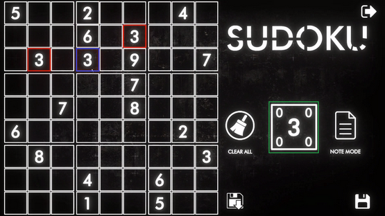

# Rapport de la phase 1 du projet de session

* Elouanes Khelifi
* Ayoub Ben Ayed
* Benoit Légaré
* Gabriel Godin
* Kokou Joeal agbogan

## Introduction

Ce programme est un jeu de Sudoku conçu à l’aide de la plateforme de développement Unity et avec le langage de programmation C#. Celui-ci à comme fonction de vérifier si le chiffre inséré dans une case est variable valide, il vérifie s’il n’y pas de doublon dans le bloc (regroupement de 9 cases) en question, dans l’axe X et Y. On peut aussi insérer des notes avec deux méthodes de notations différentes (dans les coins ou dans le milieu). De plus, il est possible de sauvegarder sa partie en cours et de la recharger plus tard.

## Principe solides

### Ouvert/Fermé

On peut retrouver le principe Solide Ouvert/Fermé dans l’exemple ci-dessus. On peut voir que la classe Tile est utilisée par la classe bloc, mais Tile reste fermée et elle ne peut pas être modifiée par autres qu’elle-même.Tile renferme l’intégralité de sa structure interne et elle expose uniquement ses méthodes pour que le seul comportement désiré s’applique aux attributs de cette classe. De plus, on peut constater que s’il y a des modifications futures apportées à la classe Tile, il n’y aura aucun impact sur les autres classes étant donné que Bloc fait uniquement une liste de l’objet Tile. On pourrait alors ajouter des attributs sans crainte de répercussion. On peut donc facilement l’étendre dans le futur.

### Responsabilité unique

Nous avons appliqué le principe de responsabilité unique durant notre conception lors de la création des classes associés à la grille des valeurs. Afin de limiter la responsabilité de la grille de bloc lors de la vérification de doublons, celle-ci fait appel à sa méthode `AnalyseGrid()` afin de déléguer au blocs la vérification de leur propres tuiles.

Nous avons également séparé les blocs et les tuiles afin que chacun ait ses propres responsabilités. Les blocs font appel à leurs méthodes `AnalyseBloc()` qui vérifie les valeurs des tuiles.

### Substitution de Liskov

Notre système de chargement et de sauvegarde respecte le principe de substitution de Liskov, car la classe `BinaryPersistance` implémente la classe abstraite `FilePersistance` et nous pouvons remplacer les objets de type `BinaryPersistance` dans le code par des objets implémentant la classe `FilePersistance` tout en gardant le code de notre système cohérent.

### Ségrégation des interfaces

Étant donné que nous avons utilisé le moteur de jeu unity pour gérer le côté visuel, nous avons dû implanter les composants de unity dans nos classes pour les lier à l’interface de unity.

Par conséquent, nos classes redéfinissent, selon leurs besoins, fonctions offertes par la classe `MonoBehaviour` et le moteur peut par la suite exécuter du code selon les besoins de la classe.

### Injection de dépendances

Afin de rendre notre système plus extensible au niveau de la sauvegarde et du chargement d’une partie, nous avons appliqué le principe d’injection de dépendances. En effet, lorsque le code entre la fonction de sauvegarde de partie `OnSave(string _fileName)`, celui-ci accède à un objet de type `IPersistance` et appelle sa fonction `SaveGrid(BlocGrid _grid , string _fileName)`.

Nous pouvons donc créer des classes qui implémentent l’interface `IPersistance` pour changer la façon de sauvegarder la partie.

## Patrons Grasp

### Spécialiste

Dans cette situation on peut constater que GridBloc est un exemple du principe du spécialiste. GridBloc connaît toutes les informations sur les blocs et les tiles qu’elle contient. Elle a donc la responsabilité de faire l’analyse, car elle connaît le plus d'informations.

### Créateur

On peut retrouver un exemple du principe créateur de Grasp dans l’image ci-dessus. Dans cette situation BlocGrid est notre créateur, car elle est composée de block et elle est celle qui possède l’information de la position des blocks. La BlocGrid a donc la responsabilité de créer les blocks et de leur assigner une position.

### Contrôleur

Elle a comme mission de vérifier les variables rentrées par l’utilisateur. Elle vérifie si la variable est bien un chiffre entre 1 et 9. Elle empêche donc que des lettres ou autres caractères de se rendre plus loin. Si la variable passe toutes les vérifications, elle pourra alors être envoyée à la tile sélectionner (encadré en bleu dans l’image ci-dessus), puis la enregistrera la variable. Ainsi Big Tile contrôle et empêche le monde extérieur d'interagir directement avec l’objet Tile.
